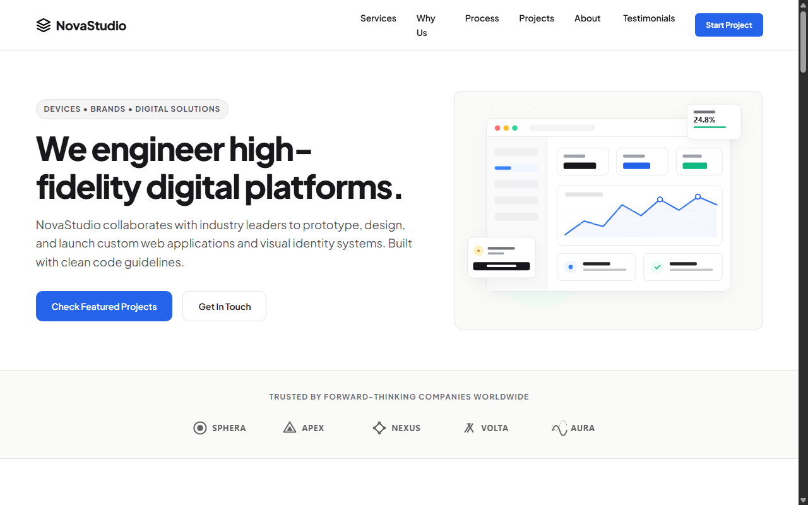
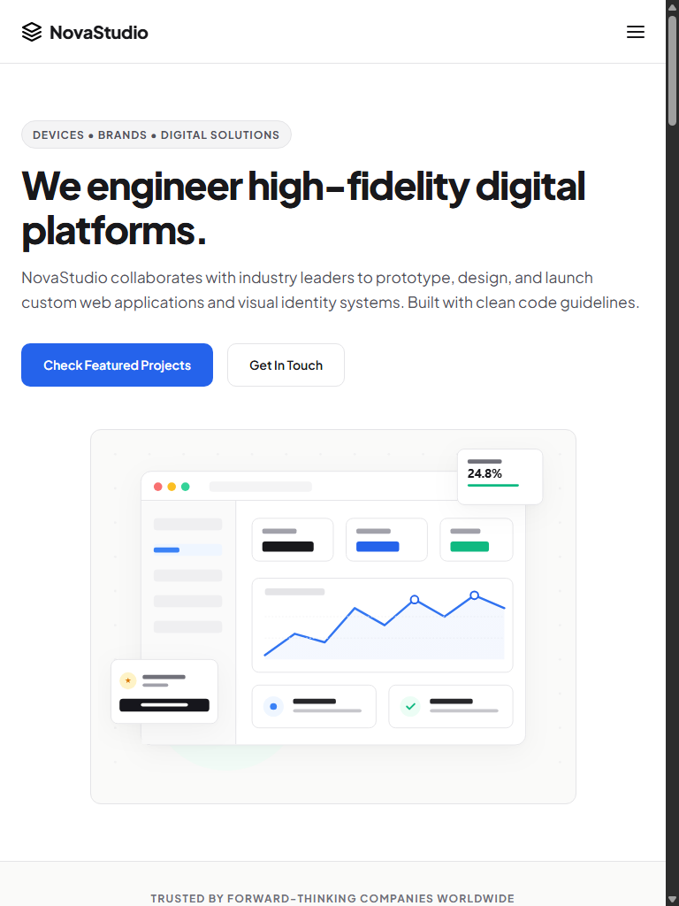
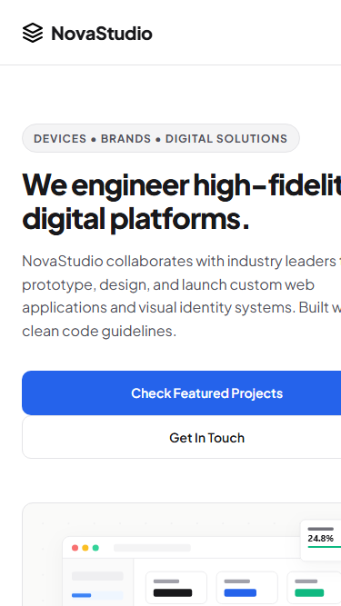

# NovaStudio - Responsive Digital Creative Agency

NovaStudio is a premium, modern, and fully responsive landing page for a fictional digital creative agency. The website showcases a clean, light-themed, human-designed aesthetic inspired by Figma, Notion, and Stripe. It is built entirely using semantic HTML5 and advanced CSS3 features, with no JavaScript or external CSS/component libraries.

---

## 🎨 Features

- **Split Layout Hero Section**: Clean typographic presentation on the left, paired with a custom workspace dashboard mockup illustration on the right.
- **Trusted By Section**: Flex layout grid displaying monochrome SVG partner logos.
- **Services Stack**: Grid-based services cards with clean micro-interaction elevations on hover.
- **Why Choose Us Section**: Value propositions coupled with a specs-aligned vector graphic.
- **The Process Timeline**: 4-step workflow demonstrating horizontal dashed connectors on desktop viewports.
- **Featured Projects**: Card layout highlighting case study visual mockups with hover-zoom zoom transformations.
- **About Us & Stats**: Segment featuring key accomplishments and clean numeric statistics panels.
- **Testimonials Panel**: Grid of stacked static card quotes from agency client leaders.
- **Sticky Nav Header**: Persistent top bar with a custom pure HTML/CSS responsive hamburger checkbox toggle drawer for mobile devices.
- **Call-to-Action Section**: Prominent conversion banner encouraging starting a project.

---

## 💻 Responsive Design Highlights

- **Mobile-First Approach**: CSS rules stack and render optimally for small screen sizes first, scaling up natively as viewports widen.
- **Strict 8px Rhythm System**: Visual rhythm variables and margin-paddings constructed in multiples of 8px.
- **Fluid Typography**: Dynamic element dimensions scaling smoothly using `clamp()` logic.
- **CSS Grid & Flexbox**: CSS Grid used for major layouts, and Flexbox for minor components.
- **Responsive Images**: Custom scaling using `width: 100%`, `height: auto`, and `object-fit: cover` to prevent layouts breaking across screen sizes.
- **Widescreen Constraints**: Visible max-width container set to `1200px` to lock content width.

---

## 🛠️ Technologies Used

- **HTML5**: Semantic tags (`header`, `nav`, `main`, `section`, `article`, `footer`, `cite`, `blockquote`) conforming to high accessibility standards.
- **CSS3**: Variables, fluid clamp units, responsive layout engines, transition transformations, and media queries.
- **SVG**: Scalable vector art for logos and custom visual layouts.

---

## 📂 Folder Structure

```
decodelabs_tasks2/
├── index.html
├── style.css
├── images/
│   ├── logo.svg
│   ├── logo-company1.svg
│   ├── logo-company2.svg
│   ├── logo-company3.svg
│   ├── logo-company4.svg
│   ├── logo-company5.svg
│   ├── why-us.svg
│   └── hero-dashboard.svg
├── .gitignore
└── README.md
```

---

## 📸 Screenshots

*(Screenshots will display here when generated)*

### 1. Desktop Viewport (1280px)


### 2. Tablet Viewport (768px)


### 3. Mobile Viewport (375px) - Closed


---

## 🚀 How to Run the Project

Since this project contains zero dependencies, you can run it locally in any environment:

1. **Option A: Direct Execution**
   - Open `index.html` directly in any web browser.

2. **Option B: Local Web Server (Recommended)**
   - Run a light local web server inside the project root folder. For example, using Python:
     ```bash
     python -m http.server 8080
     ```
   - Open your browser and navigate to `http://localhost:8080/`.

---

## 👤 Author

**NovaStudio Frontend Redesign**
- Created as a responsive frontend showcase of clean layout practices and semantic markup standards.
